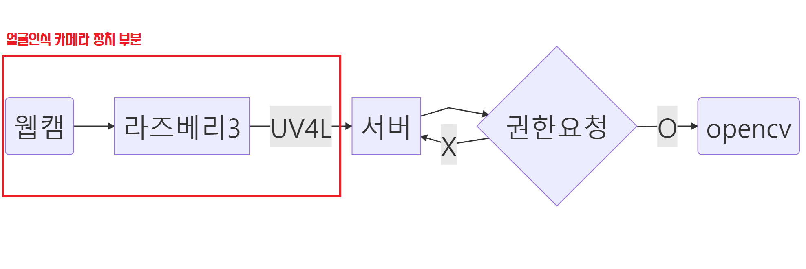

# CameraPi
얼굴인식 카메라를 사용하는 RPi 관련 부분 / 웹캠, 라즈베리파이3, UV4L에 대해 다룹니다.



```
#Graph Mermaid code (markdown)
graph LR
A(웹캠)-->B[라즈베리3]
B-->|UV4L| C[서버]
C-->D{권한요청}
D-->|X| C
D-->|O| E(opencv)
```


##  ✅ TODO

⬜ 라즈베리파이3 OS 설치 및 기본설정

⬜ 웹캠 연결 및 테스트

⬜ UV4L 설치 후, 로컬 스트리밍 테스트

⬜ 서버측에서 정상적으로 스트리밍 되는지 확인

⬜ 조도센서값이 낮을때, LED 점등


## 참고자료

### UV4L를 이용한 실시간 스트리밍 (Pi Cam)
1 : https://code-developer.tistory.com/56  
2 : https://m.blog.naver.com/PostView.naver?isHttpsRedirect=true&blogId=rhrkdfus&logNo=221405053557  
3 : https://emptybox031.tistory.com/entry/%EB%9D%BC%EC%A6%88%EB%B2%A0%EB%A6%AC%ED%8C%8C%EC%9D%B43%EA%B3%BC-UV4L%EB%A1%9C-%EA%B5%AC%ED%98%84%ED%95%98%EB%8A%94-%EB%B9%84%EB%94%94%EC%98%A4-%EC%8A%A4%ED%8A%B8%EB%A6%AC%EB%B0%8D2-UV4L-%EC%84%A4%EC%B9%98%EB%B0%8F-%EC%84%A4%EC%A0%95  


### UV4L를 이용한 실시간 스트리밍 (Web Cam)
1 : 라즈베리파이 웹캠 인식 fswebcam avconv : https://m.blog.naver.com/PostView.naver?isHttpsRedirect=true&blogId=audiendo&logNo=220799711999  


### 라즈베리파이 OpenCV를 이용 얼굴인식과 동작캡처로 구글 어시스턴트 동작하기

https://m.blog.naver.com/PostView.naver?isHttpsRedirect=true&blogId=cosmosjs&logNo=221344080130
