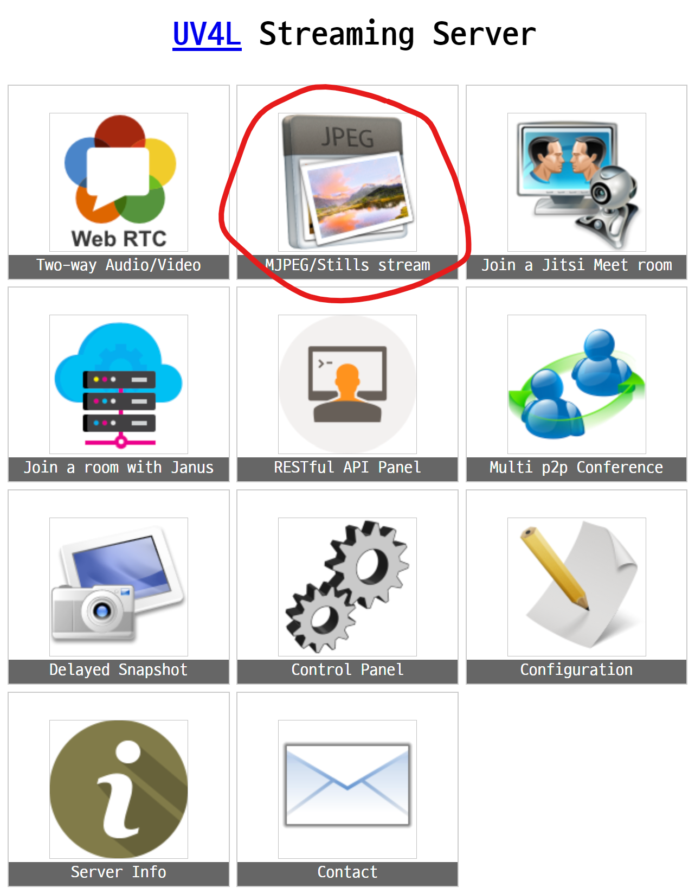
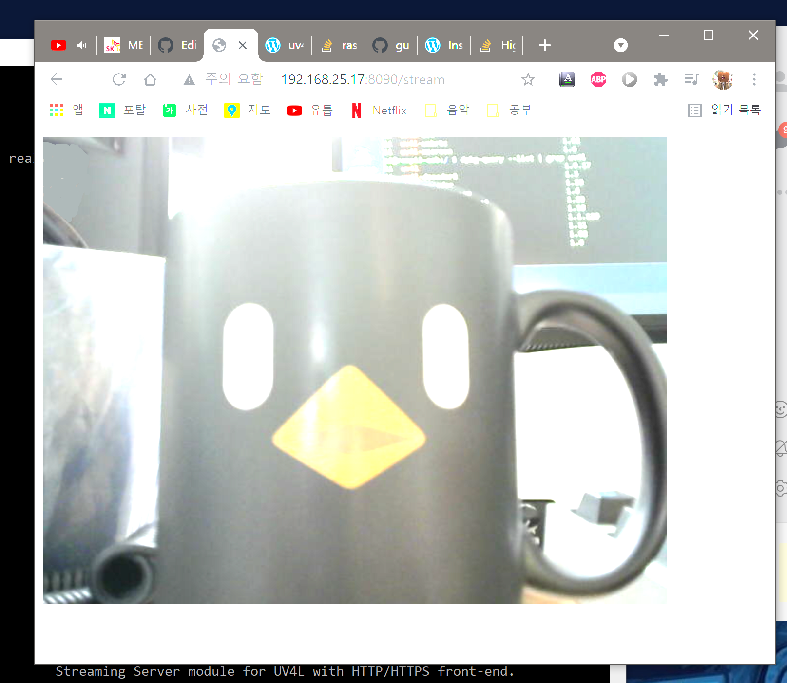

# CameraPi 개요
얼굴인식 카메라를 사용하는 RPi 관련 부분 / 웹캠, 라즈베리파이3, UV4L에 대해 다룹니다.  
더불어 촬영시 어두운 환경일 경우 자동으로 LED를 ON하는 아두이노에 대해서도 다룹니다.


```
#Graph Mermaid code (markdown)
graph LR
A(웹캠)-->B[라즈베리3]
B-->|UV4L| C[서버]
C-->D{권한요청}
D-->|X| C
D-->|O| E(opencv)
```


## 📄 Tech Spec

- VPN : openVPN
- VPN IP : 10.8.0.2 (External 51820 UDP)
- UV4L Streaming WEB Port : 8090
- AMQP 0-9-1 Protocol (RabbitMQ Server, Pika)
- UV4L WEB Streaming


## 📁Tree

```
📁 CameraClient
┗ 📄 camera_client.py
┗ 📁 module
  ┗ 📄 rabbitmq_client.py
┗ 📁 uv4l
  ┗ 📄 run_uv4l.sh
  ┗ 📄 uv4l-uvc.conf
┗ 📁 vpn
  ┗ 📄 auth.txt
  ┗ 📄 camera.ovpn
  ┗ 📄 openvpn_start.sh

📁 .config
┗ 📁 autostart
  ┗ 📄 RUN_OPENVPN.desktop
  ┗ 📄 CAMERA_MQTT_CLIENT.desktop
```


##  ✅ TODO

✅ 라즈베리파이3 OS 설치 및 기본설정

✅ 웹캠 연결 및 테스트

✅ UV4L 설치 후, 로컬 웹 스트리밍 테스트

✅ UV4L 외부 웹 스트리밍 테스트

✅ UV4L to openCV 외부 레벨 테스트 (서버측에서 정상적으로 사진을 받아올 수 있는지)

✅ VPN 서비스(openVPN) 연결을 통한 자체 보안 인증 네트워크 구성

✅ 얼굴인식 진행중인경우(AMQP 메세지를 통해 판단), 조도센서값이 낮은 경우 LED 점등 (운전중일때는 동작 X)

⬜ 부팅시 자동으로 VPN에 연결하고 관리하는 프로그램 작성

⬜ 부팅시 자동으로 UV4L Streaming을 진행하고 관리하는 프로그램 작성

⬜ 부팅시 자동으로 AMQP(RabbitMQ)에 접속하여 메세지를 불러오는 프로그램 작성

   

# 웹캠 연결 테스트
### USB 웹캠 연결 확인

bash쉘에서 lsusb 명령어를 입력하여 정상적으로 장치가 연결되었는지 확인합니다.
```console
pi@raspi3-ecb:~ $ lsusb
Bus 001 Device 004: ID 046d:081b Logitech, Inc. Webcam C310
Bus 001 Device 003: ID 0424:ec00 Standard Microsystems Corp. SMSC9512/9514 Fast Ethernet Adapter
Bus 001 Device 002: ID 0424:9514 Standard Microsystems Corp. SMC9514 Hub
Bus 001 Device 001: ID 1d6b:0002 Linux Foundation 2.0 root hub
```


### 웹캠 사양 확인

bash쉘에서 v4l2-ctl --list-format-ext 명령어를 사용하여 해당 웹캠의 사양을 확인할 수 있습니다.
```console
pi@raspi3-ecb:~ $ v4l2-ctl --list-formats-ext
ioctl: VIDIOC_ENUM_FMT
        Index       : 0
        Type        : Video Capture
        Pixel Format: 'YUYV'
        Name        : YUYV 4:2:2
                Size: Discrete 640x480
                        Interval: Discrete 0.033s (30.000 fps)
                        Interval: Discrete 0.040s (25.000 fps)
                        Interval: Discrete 0.050s (20.000 fps)
                        Interval: Discrete 0.067s (15.000 fps)
                        Interval: Discrete 0.100s (10.000 fps)
                        Interval: Discrete 0.200s (5.000 fps)
                Size: Discrete 160x120
                        Interval: Discrete 0.033s (30.000 fps)
                        Interval: Discrete 0.040s (25.000 fps)
                        Interval: Discrete 0.050s (20.000 fps)
                        Interval: Discrete 0.067s (15.000 fps)
                        Interval: Discrete 0.100s (10.000 fps)
                        Interval: Discrete 0.200s (5.000 fps)
                Size: Discrete 176x144
                        Interval: Discrete 0.033s (30.000 fps)
                        Interval: Discrete 0.040s (25.000 fps)
                        Interval: Discrete 0.050s (20.000 fps)
                        Interval: Discrete 0.067s (15.000 fps)
                        Interval: Discrete 0.100s (10.000 fps)
                        Interval: Discrete 0.200s (5.000 fps)
                Size: Discrete 320x176
                        Interval: Discrete 0.033s (30.000 fps)
                        Interval: Discrete 0.040s (25.000 fps)
                        Interval: Discrete 0.050s (20.000 fps)
                        Interval: Discrete 0.067s (15.000 fps)
                        Interval: Discrete 0.100s (10.000 fps)
                        Interval: Discrete 0.200s (5.000 fps)
                Size: Discrete 320x240
                        Interval: Discrete 0.033s (30.000 fps)
                        Interval: Discrete 0.040s (25.000 fps)
                        Interval: Discrete 0.050s (20.000 fps)
                        Interval: Discrete 0.067s (15.000 fps)
                        Interval: Discrete 0.100s (10.000 fps)
                        Interval: Discrete 0.200s (5.000 fps)
                Size: Discrete 352x288
                        Interval: Discrete 0.033s (30.000 fps)
                        Interval: Discrete 0.040s (25.000 fps)
                        Interval: Discrete 0.050s (20.000 fps)
                        Interval: Discrete 0.067s (15.000 fps)
                        Interval: Discrete 0.100s (10.000 fps)
                        Interval: Discrete 0.200s (5.000 fps)
                Size: Discrete 432x240
                        Interval: Discrete 0.033s (30.000 fps)
                        Interval: Discrete 0.040s (25.000 fps)
                        Interval: Discrete 0.050s (20.000 fps)
                        Interval: Discrete 0.067s (15.000 fps)
                        Interval: Discrete 0.100s (10.000 fps)
                        Interval: Discrete 0.200s (5.000 fps)
                Size: Discrete 544x288
                        Interval: Discrete 0.033s (30.000 fps)
                        Interval: Discrete 0.040s (25.000 fps)
                        Interval: Discrete 0.050s (20.000 fps)
                        Interval: Discrete 0.067s (15.000 fps)
                        Interval: Discrete 0.100s (10.000 fps)
                        Interval: Discrete 0.200s (5.000 fps)
                Size: Discrete 640x360
                        Interval: Discrete 0.033s (30.000 fps)
                        Interval: Discrete 0.040s (25.000 fps)
                        Interval: Discrete 0.050s (20.000 fps)
                        Interval: Discrete 0.067s (15.000 fps)
                        Interval: Discrete 0.100s (10.000 fps)
                        Interval: Discrete 0.200s (5.000 fps)
                Size: Discrete 752x416
                        Interval: Discrete 0.040s (25.000 fps)
                        Interval: Discrete 0.050s (20.000 fps)
                        Interval: Discrete 0.067s (15.000 fps)
                        Interval: Discrete 0.100s (10.000 fps)
                        Interval: Discrete 0.200s (5.000 fps)
                Size: Discrete 800x448
                        Interval: Discrete 0.050s (20.000 fps)
                        Interval: Discrete 0.067s (15.000 fps)
                        Interval: Discrete 0.100s (10.000 fps)
                        Interval: Discrete 0.200s (5.000 fps)
                Size: Discrete 800x600
                        Interval: Discrete 0.050s (20.000 fps)
                        Interval: Discrete 0.067s (15.000 fps)
                        Interval: Discrete 0.100s (10.000 fps)
                        Interval: Discrete 0.200s (5.000 fps)
                Size: Discrete 864x480
                        Interval: Discrete 0.050s (20.000 fps)
                        Interval: Discrete 0.067s (15.000 fps)
                        Interval: Discrete 0.100s (10.000 fps)
                        Interval: Discrete 0.200s (5.000 fps)
                Size: Discrete 960x544
                        Interval: Discrete 0.067s (15.000 fps)
                        Interval: Discrete 0.100s (10.000 fps)
                        Interval: Discrete 0.200s (5.000 fps)
                Size: Discrete 960x720
                        Interval: Discrete 0.100s (10.000 fps)
                        Interval: Discrete 0.200s (5.000 fps)
                Size: Discrete 1024x576
                        Interval: Discrete 0.100s (10.000 fps)
                        Interval: Discrete 0.200s (5.000 fps)
                Size: Discrete 1184x656
                        Interval: Discrete 0.100s (10.000 fps)
                        Interval: Discrete 0.200s (5.000 fps)
                Size: Discrete 1280x720
                        Interval: Discrete 0.133s (7.500 fps)
                        Interval: Discrete 0.200s (5.000 fps)
                Size: Discrete 1280x960
                        Interval: Discrete 0.133s (7.500 fps)
                        Interval: Discrete 0.200s (5.000 fps)

        Index       : 1
        Type        : Video Capture
        Pixel Format: 'MJPG' (compressed)
        Name        : Motion-JPEG
                Size: Discrete 640x480
                        Interval: Discrete 0.033s (30.000 fps)
                        Interval: Discrete 0.040s (25.000 fps)
                        Interval: Discrete 0.050s (20.000 fps)
                        Interval: Discrete 0.067s (15.000 fps)
                        Interval: Discrete 0.100s (10.000 fps)
                        Interval: Discrete 0.200s (5.000 fps)
                Size: Discrete 160x120
                        Interval: Discrete 0.033s (30.000 fps)
                        Interval: Discrete 0.040s (25.000 fps)
                        Interval: Discrete 0.050s (20.000 fps)
                        Interval: Discrete 0.067s (15.000 fps)
                        Interval: Discrete 0.100s (10.000 fps)
                        Interval: Discrete 0.200s (5.000 fps)
                Size: Discrete 176x144
                        Interval: Discrete 0.033s (30.000 fps)
                        Interval: Discrete 0.040s (25.000 fps)
                        Interval: Discrete 0.050s (20.000 fps)
                        Interval: Discrete 0.067s (15.000 fps)
                        Interval: Discrete 0.100s (10.000 fps)
                        Interval: Discrete 0.200s (5.000 fps)
                Size: Discrete 320x176
                        Interval: Discrete 0.033s (30.000 fps)
                        Interval: Discrete 0.040s (25.000 fps)
                        Interval: Discrete 0.050s (20.000 fps)
                        Interval: Discrete 0.067s (15.000 fps)
                        Interval: Discrete 0.100s (10.000 fps)
                        Interval: Discrete 0.200s (5.000 fps)
                Size: Discrete 320x240
                        Interval: Discrete 0.033s (30.000 fps)
                        Interval: Discrete 0.040s (25.000 fps)
                        Interval: Discrete 0.050s (20.000 fps)
                        Interval: Discrete 0.067s (15.000 fps)
                        Interval: Discrete 0.100s (10.000 fps)
                        Interval: Discrete 0.200s (5.000 fps)
                Size: Discrete 352x288
                        Interval: Discrete 0.033s (30.000 fps)
                        Interval: Discrete 0.040s (25.000 fps)
                        Interval: Discrete 0.050s (20.000 fps)
                        Interval: Discrete 0.067s (15.000 fps)
                        Interval: Discrete 0.100s (10.000 fps)
                        Interval: Discrete 0.200s (5.000 fps)
                Size: Discrete 432x240
                        Interval: Discrete 0.033s (30.000 fps)
                        Interval: Discrete 0.040s (25.000 fps)
                        Interval: Discrete 0.050s (20.000 fps)
                        Interval: Discrete 0.067s (15.000 fps)
                        Interval: Discrete 0.100s (10.000 fps)
                        Interval: Discrete 0.200s (5.000 fps)
                Size: Discrete 544x288
                        Interval: Discrete 0.033s (30.000 fps)
                        Interval: Discrete 0.040s (25.000 fps)
                        Interval: Discrete 0.050s (20.000 fps)
                        Interval: Discrete 0.067s (15.000 fps)
                        Interval: Discrete 0.100s (10.000 fps)
                        Interval: Discrete 0.200s (5.000 fps)
                Size: Discrete 640x360
                        Interval: Discrete 0.033s (30.000 fps)
                        Interval: Discrete 0.040s (25.000 fps)
                        Interval: Discrete 0.050s (20.000 fps)
                        Interval: Discrete 0.067s (15.000 fps)
                        Interval: Discrete 0.100s (10.000 fps)
                        Interval: Discrete 0.200s (5.000 fps)
                Size: Discrete 752x416
                        Interval: Discrete 0.033s (30.000 fps)
                        Interval: Discrete 0.040s (25.000 fps)
                        Interval: Discrete 0.050s (20.000 fps)
                        Interval: Discrete 0.067s (15.000 fps)
                        Interval: Discrete 0.100s (10.000 fps)
                        Interval: Discrete 0.200s (5.000 fps)
                Size: Discrete 800x448
                        Interval: Discrete 0.033s (30.000 fps)
                        Interval: Discrete 0.040s (25.000 fps)
                        Interval: Discrete 0.050s (20.000 fps)
                        Interval: Discrete 0.067s (15.000 fps)
                        Interval: Discrete 0.100s (10.000 fps)
                        Interval: Discrete 0.200s (5.000 fps)
                Size: Discrete 800x600
                        Interval: Discrete 0.033s (30.000 fps)
                        Interval: Discrete 0.040s (25.000 fps)
                        Interval: Discrete 0.050s (20.000 fps)
                        Interval: Discrete 0.067s (15.000 fps)
                        Interval: Discrete 0.100s (10.000 fps)
                        Interval: Discrete 0.200s (5.000 fps)
                Size: Discrete 864x480
                        Interval: Discrete 0.033s (30.000 fps)
                        Interval: Discrete 0.040s (25.000 fps)
                        Interval: Discrete 0.050s (20.000 fps)
                        Interval: Discrete 0.067s (15.000 fps)
                        Interval: Discrete 0.100s (10.000 fps)
                        Interval: Discrete 0.200s (5.000 fps)
                Size: Discrete 960x544
                        Interval: Discrete 0.033s (30.000 fps)
                        Interval: Discrete 0.040s (25.000 fps)
                        Interval: Discrete 0.050s (20.000 fps)
                        Interval: Discrete 0.067s (15.000 fps)
                        Interval: Discrete 0.100s (10.000 fps)
                        Interval: Discrete 0.200s (5.000 fps)
                Size: Discrete 960x720
                        Interval: Discrete 0.033s (30.000 fps)
                        Interval: Discrete 0.040s (25.000 fps)
                        Interval: Discrete 0.050s (20.000 fps)
                        Interval: Discrete 0.067s (15.000 fps)
                        Interval: Discrete 0.100s (10.000 fps)
                        Interval: Discrete 0.200s (5.000 fps)
                Size: Discrete 1024x576
                        Interval: Discrete 0.033s (30.000 fps)
                        Interval: Discrete 0.040s (25.000 fps)
                        Interval: Discrete 0.050s (20.000 fps)
                        Interval: Discrete 0.067s (15.000 fps)
                        Interval: Discrete 0.100s (10.000 fps)
                        Interval: Discrete 0.200s (5.000 fps)
                Size: Discrete 1184x656
                        Interval: Discrete 0.033s (30.000 fps)
                        Interval: Discrete 0.040s (25.000 fps)
                        Interval: Discrete 0.050s (20.000 fps)
                        Interval: Discrete 0.067s (15.000 fps)
                        Interval: Discrete 0.100s (10.000 fps)
                        Interval: Discrete 0.200s (5.000 fps)
                Size: Discrete 1280x720
                        Interval: Discrete 0.033s (30.000 fps)
                        Interval: Discrete 0.040s (25.000 fps)
                        Interval: Discrete 0.050s (20.000 fps)
                        Interval: Discrete 0.067s (15.000 fps)
                        Interval: Discrete 0.100s (10.000 fps)
                        Interval: Discrete 0.200s (5.000 fps)
                Size: Discrete 1280x960
                        Interval: Discrete 0.033s (30.000 fps)
                        Interval: Discrete 0.040s (25.000 fps)
                        Interval: Discrete 0.050s (20.000 fps)
                        Interval: Discrete 0.067s (15.000 fps)
                        Interval: Discrete 0.100s (10.000 fps)
                        Interval: Discrete 0.200s (5.000 fps)
```

### 사용전 설정
bash쉘에서 `sudo raspi-config`를 입력하여 설정화면으로 접속합니다. 이후 `interface config`에서 `camera` 옵션을 enable 시켜주면 됩니다.  
또한 그래픽처리가 지속적으로 필요하므로 `advanced` 에서 `memory split`을 256MB 이상으로 설정해줍니다.

### 간단한 동작테스트 (카메라 정상여부 확인)
fswebcam 명령어를 이용하여 웹캠으로 간단한 사진캡처가 가능합니다. 해당 명령어에 사용된 옵션은 1280x960의 해상도`-r 1280*960` 으로 사진하단에 시간이 찍히지 않게`--no-banner` 캡처하여 `image2.jpg` 경로에 저장하라는 뜻입니다.
```console
pi@raspi3-ecb:~ $ fswebcam -r 1280*960 --no-banner image2.jpg
--- Opening /dev/video0...
Trying source module v4l2...
/dev/video0 opened.
No input was specified, using the first.
Adjusting resolution from 1280x-1 to 1280x960.
--- Capturing frame...
Captured frame in 0.00 seconds.
--- Processing captured image...
Disabling banner.
Writing JPEG image to 'image2.jpg'.
```


# UV4L 설치

UV4L 라이브러리를 다운받기 위하여 먼저 저장소 정보를 `/etc/apt/sources.list`에 아래와 같이 추가합니다.
```console
$ sudo vi /etc/apt/sources.list
deb http://www.linux-projects.org/listing/uv4l_repo/raspbian/stretch stretch     main
```

이후 패키지관련 정보를 업데이트해준뒤에, UV4L 패키지를 설치합니다. 대표적으로 `uv4l`, `uv4l-server`, `uv4l-uvc`, `uv4l-webrtc`를 설치합니다.
```console
$ sudo apt-get update
$ sudo apt-get install ***

========== 동작 시스템에서 설치한 패키지 참고 ==========
pi@raspi3-ecb:/ $ dpkg-query --list | grep uv4l
ii  uv4l                                  1.9.17                             armhf        User space Video4Linux Framework Core
ii  uv4l-decoder2                         1.3                                armhf        Video Hardware Decoder support for the
ii  uv4l-encoder                          1.20                               armhf        Video Hardware Encoder support for the
ii  uv4l-mjpegstream                      1.6                                armhf        MJPEGStream driver module for UV4L.
rc  uv4l-raspicam-extras                  1.53                               armhf        Extras for the CSI Camera Board driver for Raspberry Pi.
ii  uv4l-renderer                         1.10                               armhf        Video Renderer for the WebRTC Extension
ii  uv4l-server                           1.1.129                            armhf        Streaming Server module for UV4L with HTTP/HTTPS front-end.
ii  uv4l-uvc                              1.11                               armhf        Usb Video Class driver module for UV4L.
ii  uv4l-webrtc                           1.92                               armhf        WebRTC extension for the
ii  uv4l-xscreen                          1.6                                armhf        XScreen driver module for UV4L.
=======================================================
```


### UV4L 실행

아래 명렁어를 통해 uv4l을 시작합니다. 또는 아래 명령어가 부팅시 백그라운드에서 자동실행됩니다.
```console
$ uv4l --external-driver --device-name=video0
or
$ /usr/bin/uv4l -k --sched-rr --mem-lock --config-file=/etc/uv4l/uv4l-uvc.conf --driver uvc --driver-config-file=/etc/uv4l/uv4l-uvc.conf --server-option=--editable-config-file=/etc/uv4l/uv4l-uvc.conf --device-id 046d:081b
```


### UV4L 스트리밍 확인 (WebPage)

webRTC 패키지를 설치하였기 때문에 HTTP 프로토콜을 통하여 실시간-스트리밍 영상을 확인할 수 있습니다.
브라우저에서 `http://<IP>:<PORT>/stream`에 접속하여 바로 확인 가능합니다. 또는 `http://<IP>:<PORT>/`에 접속하여 각 메뉴를 확인할 수 있습니다.



### UV4L 스트리밍 확인 예시

아래 사진과 같이 실시간으로 웹캠 영상이 WEB으로 스트리밍 됩니다.



 

# 참고자료

### Linux Opencv 설치
공식Build : https://docs.opencv.org/4.5.2/d7/d9f/tutorial_linux_install.html
파이썬-PreBuild : https://softtone-someday.tistory.com/8

### UV4L를 이용한 실시간 스트리밍 (Pi Cam)
UV4L 설치 공식문서 : https://www.linux-projects.org/uv4l/installation/ , https://github.com/TJiiii/pipycctv  
1 : https://code-developer.tistory.com/56  
2 : https://m.blog.naver.com/PostView.naver?isHttpsRedirect=true&blogId=rhrkdfus&logNo=221405053557  
3 : https://emptybox031.tistory.com/entry/%EB%9D%BC%EC%A6%88%EB%B2%A0%EB%A6%AC%ED%8C%8C%EC%9D%B43%EA%B3%BC-UV4L%EB%A1%9C-%EA%B5%AC%ED%98%84%ED%95%98%EB%8A%94-%EB%B9%84%EB%94%94%EC%98%A4-%EC%8A%A4%ED%8A%B8%EB%A6%AC%EB%B0%8D2-UV4L-%EC%84%A4%EC%B9%98%EB%B0%8F-%EC%84%A4%EC%A0%95  
4 : https://www.highvoltagecode.com/post/webrtc-on-raspberry-pi-live-hd-video-and-audio-streaming  
5 : https://github.com/guido57/IReye  


### 라즈베리파이 웹캠 인식 fswebcam avconv
1 : 라즈베리파이 웹캠 인식 fswebcam avconv : https://m.blog.naver.com/PostView.naver?isHttpsRedirect=true&blogId=audiendo&logNo=220799711999  
2 : 라즈베리파이 웹캠 사용 : http://wiki.bitplan.com/index.php/Raspberry_PI_WebCam


### 라즈베리파이 OpenCV를 이용 얼굴인식과 동작캡처로 구글 어시스턴트 동작하기
https://m.blog.naver.com/PostView.naver?isHttpsRedirect=true&blogId=cosmosjs&logNo=221344080130
